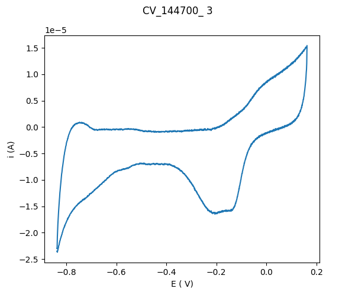
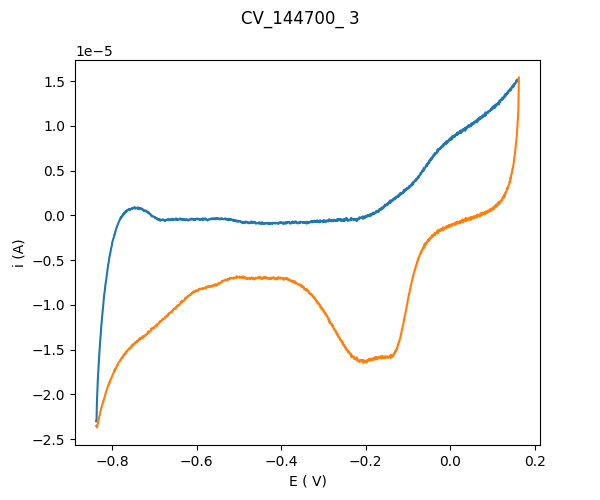

Example class CV_data()
================================================

Start by downloading a test file from github:

`CV_144700_3.tdms <https://github.com/Guswib/EC4py/blob/0ac6f225816d6583b3aa6b8c62fd8a19de10dc17/test_data/CV/CV_144700_%203.tdms>`_

and save it an approprite folder.

Import the class:

.. code-block:: python

   from ec4py import CV_Data

Load a file:

.. code-block:: python

   data = CV_Data("CV_144700_3.tdms")

Plot file

.. code-block:: python

   data.plot()

Visualize that a CV consists of two LSV;

.. code-block:: python
   
   line, p = data.plot(dir="pos")
   data.plot(dir="neg", plot = p)

