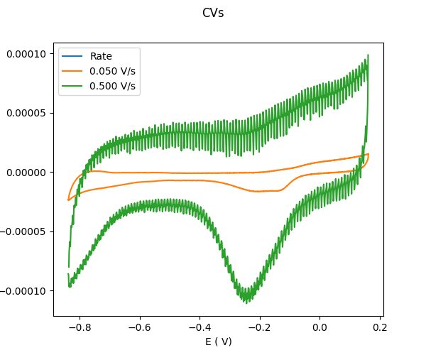
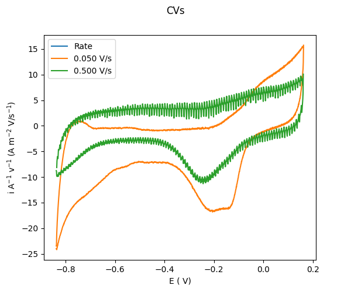

# Example class cv_datas
================================================


Start by downloading a test file from github:

#. `CV_144700_3.tdms <https://github.com/Guswib/EC4py/blob/0ac6f225816d6583b3aa6b8c62fd8a19de10dc17/test_data/CV/CV_144700_%203.tdms>`_

and save it an approprite folder.

Import the class:

```python
   from ec4py import CV_Datas
```
# Load a file:


```python
   fileList= [
               "CV_144700_3.tdms",
               "CV_144700_3.tdms"
   ]

   datas = CV_Datas(fileList)
```


## Plot file

```python
   datas.plot()
```



## Visualize that a CV consists of two LSV;

```python
   line, p = data.plot(dir="pos")
   data.plot(dir="neg", plot = p)
```


.. image:: cv_datas_ex1_fig2.png
  :width: 400
  :alt: Alternative text
